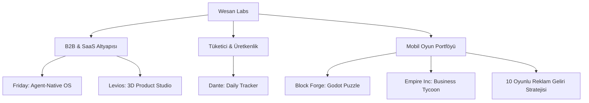

# Wesan Labs - Girişim ve Oyun Portföyü Yatırım Sunum Dosyası (Pitch Deck)

> **Tarih:** 2026-07-08  
> **Hazırlayan:** Antigravity (AI Mentor)  
> **Kapsam:** Friday, Levios/wesanjs, Dante, Block Forge, Empire Inc. ve 10 Oyunlu Mobil Portföy Stratejisi  
> **Hedef:** Wesan Labs çatısı altındaki yüksek teknoloji SaaS araçları, 3D e-ticaret altyapısı, offline-first üretkenlik uygulamaları ve veri odaklı mobil oyun stüdyosu vizyonunu yatırımcılara sunmak.

---

## 🚀 Yönetici Özeti (Executive Summary)

Wesan Labs, yazılım geliştirme araçlarından (SaaS) interaktif e-ticaret motorlarına, veri odaklı mobil oyunlardan günlük kişisel takip araçlarına kadar uzanan geniş ve sinerjik bir teknoloji portföyüdür. Tüm projeler **TypeScript Strict Mode**, **Rust**, **Bun**, **React Native/Expo** ve **Godot Engine** gibi modern ve yüksek performanslı teknolojilerle, uçtan uca otomatize edilmiş (CI/CD, Fastlane) altyapılar üzerine inşa edilmiştir.



---

## 1. Friday: Agent-Native Development OS (Yazılım Geliştirme İşletim Sistemi)

Geliştiricilerin AI agent'larını (örneğin Claude Code) orkestre ettiği, yönettiği, uzaktan erişebildiği ve mobil cihazdan izleyebildiği **session-centric** (oturum merkezli) bir geliştirici işletim sistemidir. Zed Editor'ün özel bir fork'u (`wesan-labs/zed` branch `friday/main`) üzerine inşa edilmiştir.

### 💡 Çekirdek Değer Önerisi & Mimari
*   **Daemon-First Mimari:** Arka planda çalışan güçlü bir Rust daemon'ı oturumları, terminal multiplexer'ları (tmux tarzı) ve çalışma alanlarını yönetir.
*   **ACP (Agent Connection Protocol) Goal-Loop:** Ajanların otonom çalışmasını sağlayan ve adımları gerçek zamanlı izlenebilen otonom döngü sistemi.
*   **Opt+Space Floating Chat:** Editör üzerinde yüzen, OS-global kısayola sahip hızlı komut ve soru-cevap arayüzü.
*   **Cost Engine:** Harcanan AI API token'larını (Opus, Sonnet, Gemini, GPT) anlık olarak USD bazında takip eden bütçe kontrol sistemi.

### 🛠 Teknoloji Yığını (Tech Stack)
*   **Daemon:** Rust, `tokio`, `tonic` (gRPC), `libsql` (SQLite tabanlı veri katmanı)
*   **Desktop App:** Tauri 2, SolidJS, Solid UI, CodeMirror 6, GPUI (Zed UI framework)
*   **Mobile App:** Expo, React Native (uzaktan ajan izleme ve kontrol için)
*   **Protokoller:** gRPC + Protobuf, ACP, MCP (Model Context Protocol)

### 📈 Mevcut Durum & Yol Haritası
*   **✅ Bitenler:** Zed rebrand edildi, binary adı `friday` yapıldı. `friday_mission_control` paneli ve `friday_cost` USD motoru entegre edildi. Yüzen `QuickPrompt` penceresi tamamlandı. ACP goal-loop simülasyonu çalıştırıldı.
*   **🟡 Sırada:** Gerçek ACP bağlantısının yapılması (turlar arası otonom stream), otonom izin (permission allowlist/sandbox) yönetimi, SQLite persistence katmanı ve gRPC tabanlı mobil bridge.

---

## 2. Levios (wesanjs): Headless Commerce & 3D Product Studio

E-ticaret markalarının en büyük problemi olan **sadık ürün görseli (fidelity)** krizini aşmak için geliştirilmiş, 3D modelleme tabanlı interaktif içerik ve ürün stüdyosudur. Popüler açık kaynaklı headless commerce altyapısı **MedusaJS** üzerine özel eklentilerle kurgulanmıştır.

```
Kullanıcı Ürün Fotosu ──► FLUX.2 (Hero Görsel) ──► Seedance 2.0 (360° Orbital Video)
                              │                                │
GLB 3D Model ◄── Fotogrametri ┴── SeeDVR 4K Upscale ◄──────────┘
```

### 💡 Çekirdek Değer Önerisi & Mimari
Geleneksel AI görsel üretim araçları ürünü prompt'larla baştan yaratmaya çalıştığı için ürün sadakatini bozar. Levios bu problemi **3D Reconstruction Pipeline** ile yapısal olarak çözer:
1.  **FLUX.2 Pro (BFL API):** 8 adede kadar referans fotoğrafla arka planı temiz, marka hex kodlarına uyumlu bir "Hero" görsel üretir.
2.  **Seedance 2.0 (ByteDance):** Tek bir hero görselden, ürün kimliğini kilitleyerek (Identity Locking) 360° dönen orbital ürün videosu üretir.
3.  **SeeDVR:** Orbital videoyu 4K'ya upscale eder ve gürültüleri temizler.
4.  **Sampling & 3DGS:** Video 5 derecelik açılarla 72 kareye bölünür. Fotogrametri veya 3D Gaussian Splatting ile gerçek **GLB 3D modeline** dönüştürülür.
*   **Çıktılar:** E-ticaret sitesinde müşterinin döndürebileceği interaktif `<model-viewer>` GLB nesnesi ve sosyal medya için 4K turntable pazarlama videoları.

### 🛠 Teknoloji Yığını (Tech Stack)
*   **Backend:** MedusaJS (wesanjs), TypeScript, PostgreSQL.
*   **APIs:** Black Forest Labs (Flux2), BytePlus/Ark (Seedance), WaveSpeed (SeeDVR). (fal.ai gibi aggregator'lar güvenlik ve maliyet için devre dışı bırakılmıştır).
*   **Frontend:** React, React-Three-Fiber, Three.js, Shopify Web Components (`<model-viewer>`).

### 📈 Mevcut Durum & Yol Haritası
*   **✅ Bitenler:** Pipeline durum makinesi (`pipeline.ts`), BFL Flux2 pro adaptörü, BytePlus ve WaveSpeed video adaptörleri tamamlandı. Veri tabanı migrasyonları yapıldı. `/content/3d-demo` test paneli oluşturuldu.
*   **🟡 Sırada:** ffmpeg tabanlı kare örnekleme (sampling) modülü, S3/R2 re-hosting sistemi (BFL URL expire sürelerini aşmak için) ve MedusaJS admin paneli 3D stüdyo entegrasyonu.

---

## 3. Dante: All-in-One Daily Tracker (Kişisel Yaşam Takipçisi)

Kullanıcıların günlük aktivitelerini, antrenmanlarını, beslenmelerini, harcamalarını ve alışkanlıklarını internete bağımlı olmadan takip edebildikleri **offline-first** mobil uygulamadır.

### 💡 Çekirdek Değer Önerisi & Mimari
*   **Offline-First & Yerel Arama:** Cihazda gömülü olarak gelen ~3.7 MB boyutunda optimize edilmiş bir SQLite veri tabanı taşır. FTS5 (Full-Text Search) teknolojisiyle yiyecek, egzersiz ve supplement aramaları anında sonuç verir.
*   **Zengin Veri Kütüphanesi (Database Stats):**
    *   **1.369 Gıda:** USDA SR Legacy verilerinin Türkçe çevirisi ve yerel gıdalar.
    *   **2.251 Egzersiz:** Egzersiz veritabanlarının birleşimi ve Türkçe takma adlar.
    *   **489 Supplement:** NIH DSLD API'si ve 52 global/yerel marka (Solgar, Ocean, BigJoy vb.).
*   **PDF Program Çıkarım Sistemi:** AI ajanları aracılığıyla spor rehberleri ve PDF antrenman planları (HTK, Tactical Athlete, ACFT) analiz edilerek mobil uygulamaya aktarılabilir yapısal egzersiz planlarına dönüştürülür.

### 🛠 Teknoloji Yığını (Tech Stack)
*   **Mobile App:** React Native, Expo (EAS Build/Update), SQLite (gömülü reference.db).
*   **Backend (API):** Elysia, Bun (yüksek performanslı, ultra düşük latency edge runtime).
*   **Monetizasyon:** RevenueCat (Free, Plus, Pro, Elite abonelik katmanları).

### 📈 Mevcut Durum & Yol Haritası
*   **✅ Bitenler:** Core SQLite entegrasyonu ve FTS5 araması bitti. RevenueCat entegrasyonu tamamlandı. HTK, ACFT, 5-Mile Run gibi 6 ana antrenman programı PDF'lerden başarıyla çıkartılarak veri tabanına işlendi.
*   **🟡 Sırada:** Kalan antrenman programı OCR/markdown entegrasyonları, diyet ve supplement takip ekranlarının UI entegrasyonu.

---

## 4. Block Forge: Modern Minimalist Block Puzzle Oyunu

Modern ve minimalist bir sanat tasarımıyla arcade ruhunu harmanlayan, mobil platformlar için geliştirilmiş yüksek tempolu 3D blok bulmaca oyunudur.

### 💡 Çekirdek Değer Önerisi & Mimari
*   **Çift Kişilik Sistemi (Dual Aesthetic):**
    *   *SOFT (Modern Mode):* Pastel krem gradyanlar, dot pattern'ler ve dinlendirici ASMR sesleri.
    *   *NEON (Retro Mode):* Karanlık tema, neon ışıkları, scanline efektleri ve 8-bit arcade müzikleri.
*   **Premium Game-Feel:** Blokları sürüklerken parmak altında kalmaması için offset hesabı, "lift" (derinlik/yükselme) efekti, patlamalarda ekran kenarı parlaması (vignette) ve dinamik CPUParticles toz efektleri.
*   **Yüksek Mühendislik & Akıllı Modlar:**
    *   *Tension Frame:* Grid doluluk oranı %65 ve %85'i geçtiğinde renk değiştiren ve nabız atan uyarı çerçevesi (Near-Miss Tension).
    *   *Daily Seed Challenge:* Her gün tarih bilgisine göre üretilen bir seed ile tüm oyuncuların aynı blok sırasıyla yarışması (Today's Best skor tablosu).
    *   *Power-up Blokları:* 3x3 patlatan Bombalar, satır silen Line blokları ve en yaygın rengi temizleyen Rainbow blokları.

### 🛠 Teknoloji Yığını (Tech Stack)
*   **Motor:** Godot Engine 4.6.2 (Stable), GDScript (Strict Mode).
*   **Shader'lar:** Özel 3D canvas_item blok shader'ları (üstten aydınlatmalı, derinlik ve parlaklık hissi veren premium 3D shader).
*   **Dağıtım Pipelines:** Fastlane, Xcode CLI ve automated IPA signing betikleri (`make ios-ship` ile tek komutla TestFlight upload).

### 📈 Mevcut Durum & Yol Haritası
*   **✅ Bitenler:** Çekirdek oynanış, çift tema sistemi, 3D shader'lar, particle efektleri, Daily Seed Challenge, Time Attack modu, Power-up'lar ve TestFlight yükleme otomasyonu tamamlandı.
*   **🟡 Sırada:** Orijinal ses efektleri ve müzik paketi entegrasyonu, Google Play Store ASO optimizasyonları ve mediation (AppLovin MAX/AdMob) kurulumları.

---

## 5. Empire Inc: Veri Odaklı Mobil Tycoon Oyunu

Kullanıcıların sanal bir iş imparatorluğu kurduğu, borsa ve kripto yatırımları yaptığı, zengin bir içerik ve era sistemine sahip mobil iş simülasyonu oyunudur.

### 💡 Çekirdek Değer Önerisi & Veri Odaklı İyileştirme (Re-Engineering)
Uygulama tescilli pazarlama kanalları üzerinden günlük **~180 yeni kullanıcı (install)** almaktadır. Ancak yapılan kohort analizlerinde D1 retention'ın %3 civarında olduğu ve kullanıcıların %85'inin daha ilk işletmeyi satın almadan oyundan çıktığı gözlemlenmiştir. 
Bu "delik kova" durumunu çözmek ve ciro hedeflerini yakalamak için proje **veri odaklı re-engineering** sürecindedir:
1.  **Play-First Onboarding (P0):** İlk açılıştaki zorunlu kayıt ve username kapıları kaldırılarak kullanıcı anında **anonim (guest) oturumla** oyuna sokulur. ToS ve hesap kayıt ekranları oyunun ilerleyen evrelerine ertelenir.
2.  **Ekonomik ROI Dengelemesi:** Eski modelde seviye maliyetleri %15 artarken gelirlerin %5 artması oyunu kilitliyordu. Yeni modelde bu Roi decay kurgusal olarak "pazar doygunluğu" şeklinde anlatılıp, kullanıcıya yeni pazara açılma (Prestige/IPO) veya dikey büyüme (upgrade-tree) seçenekleri sunulmaktadır.
3.  **Subscription Parity:** Premium aboneliğin bedava reklam ödüllerinden daha değersiz olması engellenmiştir. Vergi indirimleri tier-based olarak (Pro %50 / Premium %60 / Elite %70) güncellenmiş ve satın alım motivasyonu güçlendirilmiştir.

### 🛠 Teknoloji Yığını (Tech Stack)
*   **Frontend:** React Native (Expo SDK 52), Tamagui UI, Zustand + React Query.
*   **Backend:** Supabase (Postgres RLS, PL/pgSQL ekonomi RPC'leri).
*   **İzleme & Analitik:** PostHog, Sentry, RevenueCat.

### 📈 Mevcut Durum & Yol Haritası
*   **✅ Bitenler:** Vergi dengelemeleri migration'ları ve veri tabanı optimizasyonları yapıldı. Aktif meter bonusu gelirlere bağlandı.
*   **🟡 Sırada (P0 Sprint):** Login zorunluluğunun kaldırılarak play-first onboarding akışının yayına alınması, PostHog funnel event entegrasyonlarının doğrulanması.

---

## 6. Mobil Oyun Portföy Stratejisi: Günlük £2.000 Reklam Geliri

Block Forge ve Empire Inc. projelerinden elde edilen teknik bilgi birikimi ve hazır derleme altyapıları (boilperplate) kullanılarak, toplamda **10 oyundan oluşan** yüksek eCPM odaklı bir mobil oyun portföyü kurulacaktır.

### 📊 Birim Ekonomisi Hedefi (Unit Economics)

*   **Toplam Ciro Hedefi:** £2.000 / Gün ($2.500 / Gün)
*   **Oyun Başına Ciro:** £200 / Gün
*   **Varsayılan Global eCPM:** £4,00 ($5,00) (Tier-1 iOS odaklı pazarlamayla bu oran £15+'e kadar yükselmektedir)
*   **Gereken Günlük Gösterim (Oyun başı):** $50.000$ gösterim/gün
*   **Ad Load (Kullanıcı başı günlük reklam gösterimi):** 5 adet (1 Banner + 3 Geçiş + 1 Ödüllü)
*   **Hedef DAU (Oyun başı):** 10.000 DAU
*   **Toplam Portföy DAU Hedefi:** 100.000 DAU (10 oyun toplamı)

### 🧩 Eklenecek 8 Yeni Godot Oyun Fikri (Production Pipeline)

Geliştirme süresinin çok hızlı olması (GDScript), paket boyutunun küçük olması (mağaza dönüşümü için kritik) ve ciro sınırı olmaması nedeniyle **Godot Engine** ana motor olarak seçilmiştir.

| Proje İsmi | Tür / Kategori | Çekirdek Mekanik | Reklam Kancası (Ad Loop) |
| :--- | :--- | :--- | :--- |
| **1. Hexa Merge & Sort 3D** | ASMR / Bulmaca | Renkli altıgen plakaları birleştirme, 10'lu istif patlatma. | Rewarded: Son hamleyi geri al, ekstra yuva aç. |
| **2. Idle Factory Supply Chain 3D**| Idle Tycoon | Empire Inc. ekonomisini 3D konveyör bantlarıyla görselleştirme. | Rewarded: 4 saatlik 2x üretim, çevrimdışı 3x çarpan. |
| **3. Screws, Nuts & Bolts Jam** | Fizik Bulmacası | Metal plakalardaki vidaları sırayla sökerek yerçekimiyle düşürme.| Rewarded: Ekstra delik aç, süreyi uzat. |
| **4. Match 3D: Object Finder** | Gizli Nesne | Dağınık 3D nesnelerden aynı 3'lüyü bulup temizleme. | Rewarded: Objeleri otomatik eşleştir, süreyi dondur. |
| **5. Parking Jam: Traffic Escape** | Izgara Bulmaca | Arabaları birbirine çarpmadan otoparktan tahliye etme. | Interstitial: Her seviye geçişinde. |
| **6. Merge Defense & Upgrade 2D** | Merge / TD | Savunma kulelerini birleştirip dalgaları durdurma. | Rewarded: Anında yüksek seviyeli kule çağır. |
| **7. Word Journey Daily** | Kelime Bulmaca | Karışık harf çarkından kelimeler türetme (Günlük Challenge). | Rewarded: Harf ipucu ver, kelimeyi göster. |
| **8. Hedge Fund Tycoon 3D** | Finans Simülatörü| Borsa botları kurma, ofis ve sunucu odası geliştirme. | Rewarded: İçeriden tüyo al, margin call'dan kurtul. |

---

## 💎 Yatırımcı İçin Özet: Neden Wesan Labs?

1.  **Düşük Geliştirme Maliyeti & Yüksek Hız:** Godot şablonu (boilerplate) ve Rust/Bun altyapısı sayesinde oyunlar ve SaaS modülleri haftalar içinde pazara sürülebilir durumdadır.
2.  **Sinerji:** 3D Product Studio (Levios), oyun geliştirme süreçlerindeki render/mockup ihtiyaçlarını beslerken; Dante'deki veri çıkarma yeteneği oyunlardaki AI tabanlı balance motorlarında kullanılmaktadır.
3.  **Veri Odaklı Karar Alma:** Tycoon oyunlarındaki (Empire Inc.) matematiksel re-engineering yaklaşımı, oyuncu davranış analizlerini doğrudan finansal gelire dönüştürür.
4.  **Hazır Altyapı:** CI/CD pipelines, TestFlight otomasyonları ve veritabanı şablonları tamamen kuruludur; yatırım doğrudan kullanıcı kazanımına (UA) ve içerik üretimine aktarılacaktır.
